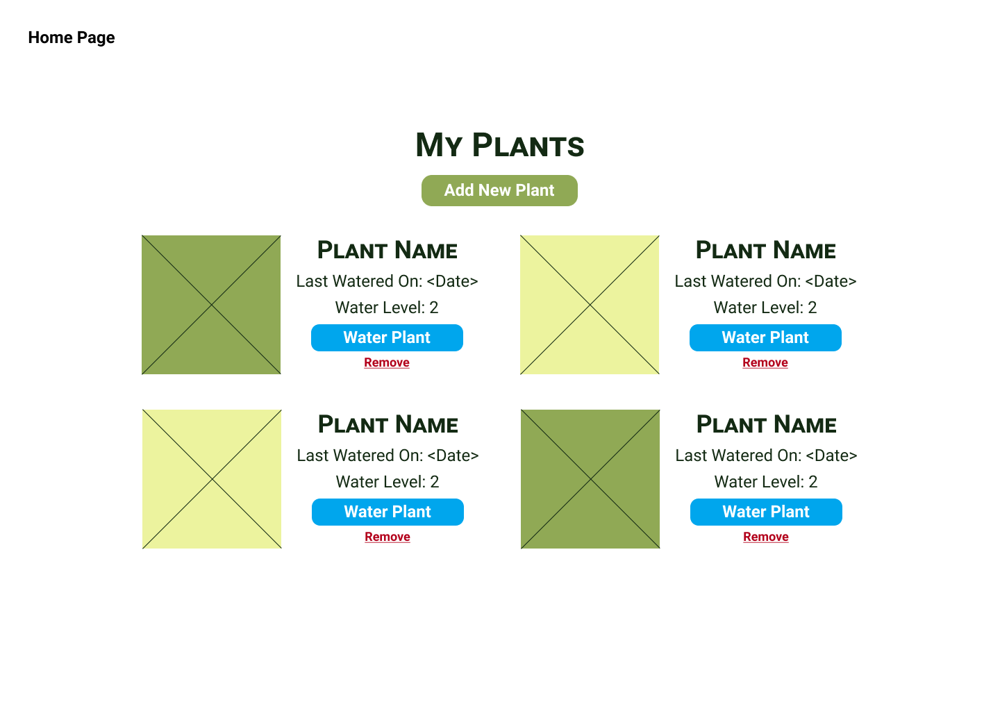
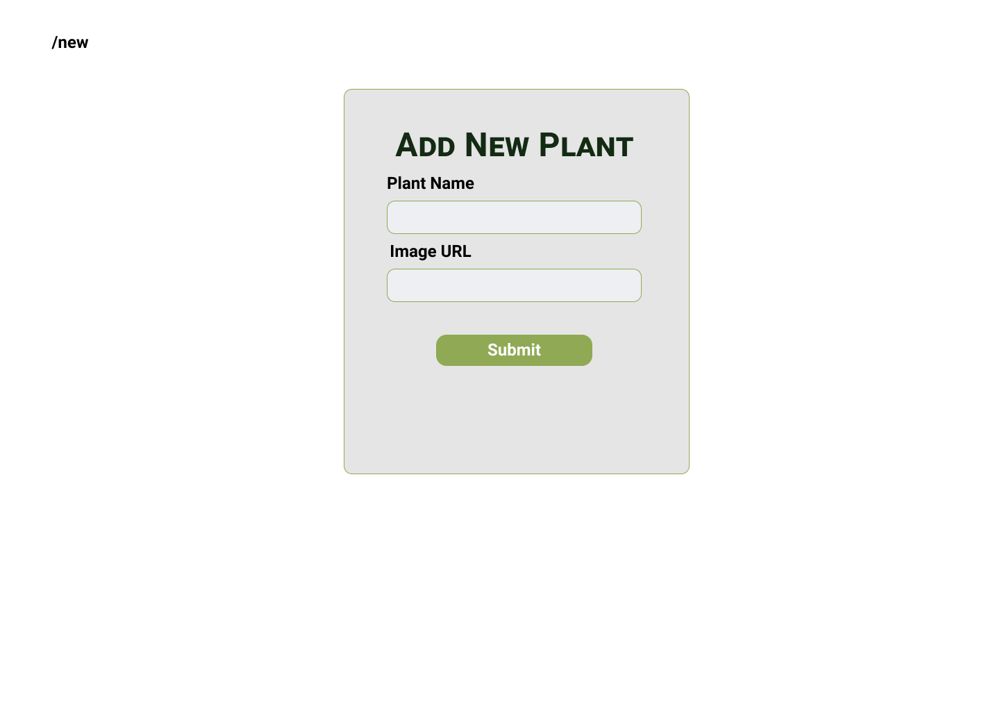

# Plant Watering App Planning Document
## Wireframes
### Home Page

### Add New


### Data Model
Name|Data Type| Default
-----|-----|---
id | Integer(Number) | Increment
name| String | None
lastWatered| Date | None
maxWaterLevel| Integer (Number)| 5
currentWaterLevel| Integer (Number) | 0

<br>
Sample Plant Object:

```javascript
{
    id: 1,
    name: "Larkspur",
    lastWatered: new Date(),
    maxWaterLevel: 5,
    currentWaterLevel: 0
}
```

### Events
1. On load
   * Check if there are any plants in local storage, if not, load the seed data
2. On click -- "Add New Plant" -- can just be a normal link to `/add`
3. On click -- "Remove plant"
3. On submit -- plant form
   * Add plant to local storage with defaults for waterLevel

### Backlog
#### Seed Data
- [ ] Create and export an array of plant objects to be loaded into local storage when the page loads -- save as plants
- [ ] Write a function called `loadData` that first checks if there is any data in local storage -- if there is data, do nothing, if there's no data, load the seed data

### Home Page
- [ ] Loop through each plant in local storage and display the plant information
- [ ] Write a function for the "Water Plant" event listener -- accepts an ID as input and will increment the waterLevel for the associated ID
- [ ] Write a function for the "Remove" event listenter -- accepts an ID as input and removes the associated plant from local storage

### Add New
- [ ] Create the HTML form including inputs for plant name and image url
- [ ] Create a function for the submit event listener that gets the information from the form and adds a new plant